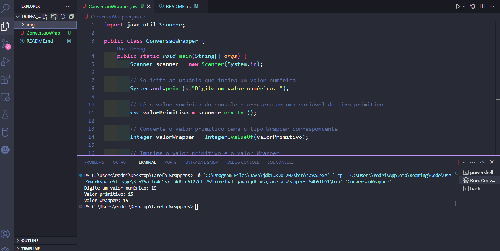
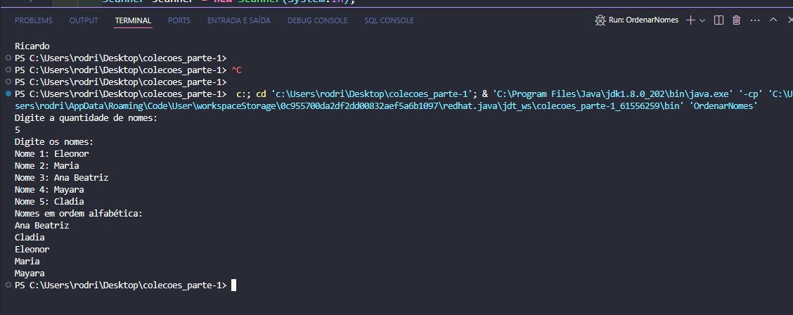

<!DOCTYPE html>
<html lang="pt-br">
<head>
    <meta charset="UTF-8">
    <meta name="viewport" content="width=device-width, initial-scale=1.0">
    <meta name="description" content=" ">
    <meta name="keywords" content="">
    <meta name="author" content="Ana Alice Rodrigues">

</head>
<body>

<header>
    <h1>Ordenar Nomes em Ordem Alfabética</h1>
    
    
</header>

    
Índice

    <ol>
        <li><a href="#sobre-o-projeto">Sobre o projeto</a></li>
        <li><a href="#parte-tecnica">Parte Técnica</a></li>
        <li><a href="#estrutura-dos-arquivos">Estrutura dos Arquivos</a></li>
        <li><a href="#casos-de-uso">Casos de Uso</a></li>
        <li><a href="#ferramentas">Ferramentas</a></li>
        <li><a href="#contato">Contato</a></li>
    </ol>

<section id="sobre-o-projeto">
    <h2>Sobre o projeto</h2>
    

        Este projeto é um programa simples em Java que recebe uma lista de nomes do usuário e os ordena em ordem alfabética. O programa utiliza a classe <code>ArrayList</code> para armazenar os nomes e a classe <code>Collections</code> para ordenar a lista.
    

    

        Proposta de Valor: Oferecer uma ferramenta simples e eficiente para organizar listas de nomes, facilitando a visualização e a ordenação alfabética em diversas situações, como listas de presença, participantes de eventos, entre outros.
    

</section>

<section id="parte-tecnica">
    <h2>Parte Técnica</h2>
    <ul>
        <li>Backend: Java é utilizado para desenvolver a lógica do programa, incluindo a leitura de entradas do usuário, armazenamento de dados e ordenação dos nomes.</li>
        <li>Entrada de Dados: Utiliza a classe <code>Scanner</code> para ler a quantidade de nomes e os próprios nomes inseridos pelo usuário.</li>
        <li>Ordenação: Utiliza a classe <code>Collections</code> para ordenar a lista de nomes em ordem alfabética.</li>
    </ul>
</section>

<section id="estrutura-dos-arquivos">
    <h2>Estrutura dos Arquivos</h2>
    <ul>
        <li><code>OrdenarNomes.java</code>: Contém o código fonte do programa em Java.</li>
    </ul>
</section>

<section id="casos-de-uso">
    <h2>Casos de Uso</h2>
    <ul>
        <li>Organização de listas de presença.</li>
        <li>Ordenação de participantes de eventos.</li>
        <li>Qualquer situação onde a ordenação alfabética de nomes seja necessária.</li>
    </ul>
</section>

<section id="ferramentas">
    <h2>Ferramentas</h2>
    <ul>
        <li></li>
        <li></li>
        <li></li>
    </ul>
</section>

<section id="contato">
    <h2>Contato</h2>
    <ul>
        <li></li>
    </ul>

</section>

</body>
</html>

